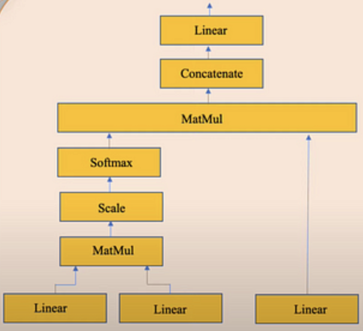

# What is LLM?

 Large Language Model(LLM)의 줄임말로 언어와 관련된 일반적인 상황, 문제에 대해 해결하고 도움을 주기 위해 만들어진 pre-trained 모델이다. 언어와 관련된 일반적인 상황이라 하면 Text Classification, Summarization, Question & Answering, Text generation 등이 있다.

LLM을 기존의 Language Model과 차별화되는 특징을 정리하면 아래와 같다

1. Large
    1. 아주 큰 데이터셋으로 학습한다. petabyte 단위의 데이터셋
    2. 모델 파라미터가 아주아주 많다. 이러한 특성으로 인해 LLM을 학습하는 작업은 쉽지 않다
2. General Purpose
    1. 사람 언어와 관련된 일반적인 상황들에 적용할 수 있다.
    2. 학습데이터와 모델의 크기가 매우 크기 때문에, 이것이 가능한 기관들이 개발하고 다른 회사나 개인이 사용할 수 있도록 한다.
3. Pre-trained and Fine Tuned
    1. Pre-trained들은 앞서 말한 General Purpose를 위해 일부 기관들이 학습시킨 모델이다
    2. Fine Tuned 모델은 General Purpose가 아닌 Specific Purpose를 위해 여러 회사/개인이 직접 domain specific한 작은 데이터셋을 가지고 학습시킨 모델이다.

## Transformer

 최신의 번역, summarize 등 언어와 관련된 모델들은 모두 Transformer 기반이며 LLM 역시 Transformer 아키텍처를 기반으로 한 모델이다.

 기존에는 Neural Network 기반, 특히 RNN(Recurrent Neural Network)기반의 모델을 사용했었지만, RNN 기반 모델들은 긴 문장을 잘 처리하지 못하고 문장을 순차적인 방식으로 학습하는 특징 때문에 병렬적으로 학습이 불가하다는 문제가 있다. Transformer는 이러한 문제들을 모두 해결함으로써 등장 당시 큰 파장을 불러일으켰다.

Transformer는 크게 3가지 특징이 있다.

1. Positional Encodings
    
    데이터 자체에 단어 순서 정보를 포함시키는 방법으로, 이것이 RNN이 병렬적으로 학습하지 못한 부분을 해결했다. 단어 순서를 나타내는 추가적인 벡터가 있어서, 임베딩 벡터에 이를 더한 후에 Neural Netowork의 input으로 들어가게 된다.
    
    

    
예시

    “Position Encoding is important” 문장을 예시로 보자. 각 단어를 아래와 같이 임베딩 벡터로 만들었다고 가정해보자.  

    - "Positional" -> [0.1, 0.2, 0.3, 0.4]
    - "Encoding" -> [0.5, 0.6, 0.7, 0.8]
    - "is" -> [0.9, 1.0, 1.1, 1.2]
    - "important" -> [1.3, 1.4, 1.5, 1.6]
    
    그리고 단어 위치를 나타내는 추가 벡터가 아래와 같이 있다고 가정해보자
    
    - 첫 번째 위치 -> [0.01,0.02,0.03,0.04]
    - 두 번째 위치 -> [0.05,0.06,0.07,0.08]
    - 세 번째 위치 -> [0.09,0.1,0.11,0.12]
    - 네 번째 위치 -> [0.13,0.14,0.15,0.16]
    
    임베딩 벡터와 위치 벡터를 더하여 최종 벡터를 만든다. 이렇게 하면 최종 벡터에는 단어에 대한 정보와 순서에 대한 정보 둘 다 포함하고 있다.
    
    - "Positional" -> [0.11,0.22,0.33,0.44]
    - "Encoding" -> [0.55,0.66,0.77,0.88]
    - "is" -> [0.99,1.1,1.21,1.32]
    - "important" -> [1.43,1.54,1.65,1.76]
    
    위치 벡터는 사전에 정의되었으며 입력 문장의 최대 길이와 임베딩 벡터 차원 크기에 따라 위치 벡터가 정해진다.
    

    
2. Attention
    
     Attention 메커니즘이란, 사람이 어떤 정보를 받았을 때 모든 정보를 보지 않고 중요한 일부분만 보고 전체를 파악한다는 아이디어에서 출발한다.
     두 시퀀스(문장) 사이의 연관성을 계산할 때 사용되는 알고리즘이다
    
    

    
Query, Key, Value

    
    아래 그림은 Attention Layer 내부 구조를 나타낸 것이다. 구조 이해를 위해 필요한 것이 바로 Query, Key, Value이다. 맨 밑에 각 Linear Layer는 왼쪽부터 Query, Key, Value가 input으로 들어가게 된다.
    
    Query와 Key의 유사도를 나타내는 Attention Score 벡터를 얻고, 이를 Value에 반영하여 최종적으로 Attention Value를 구하는 과정이다.
    
    
    
    Attention은 두 문장 간의 연관성을 계산하는 것이므로 “나는 사과를 좋아해” → “I like apples” 번역을 예로들어보자. 이 때 “I like apples”는 Query로, “나는 사과를 좋아해”는 Key와 Value로 들어간다. 들어온 문장들을 벡터화하고 그림에서 Linear는 Query, Key, Value 벡터에 서로 다른 Weight를 내적한 값으로 만든다. 그 다음 Query Linear와 Key Linear를 내적 → Mask → Scaling 과정을 통해 Attention Score를 구하고 이를 Value Linear와 내적하여 “나는 사과를 좋아해”와 “I like apples” 문장 간의 연관성을 나타내는 Attention Score 벡터가 나온다. 행렬로 계산하면 아래와 같다
    
    1. 문장 벡터화
        - Query 벡터:
            - "I" -> [0.2,0.1,0.4,0.3]
            - "like" -> [0.5,0.4,0.8,0.7]
            - "apples" -> [0.9,0.8,1.2,1.1]
        - Key 벡터:
            - "나는" -> [0.1,0.2,0.3,0.4]
            - "사과를" -> [0.5,0.6,0.7,0.8]
            - "좋아해" -> [0.9,1.0,1.1,1.2]
        - Value 벡터:
            - "나는" -> [0.1,0.2,0.3,0.4]
            - "사과를" -> [0.5,0.6,0.7,0.8]
            - "좋아해" -> [0.9,1.0,1.1,1.2]
    2. 연관성 계산
        - Query와 Key의 내적을 계산하여, Query 단어와 각 입력 단어 간의 유사도를 측정
        - 예를 들어, Query **"I"와 각 Key 간의 내적**을 계산하면:
            - 0.2∗0.1+0.1∗0.2+0.4∗0.3+0.3∗0.4=0.20.2∗0.1+0.1∗0.2+0.4∗0.3+0.3∗0.4=0.2
            - 0.2∗0.5+0.1∗0.6+0.4∗0.7+0.3∗0.8=0.740.2∗0.5+0.1∗0.6+0.4∗0.7+0.3∗0.8=0.74
            - 0.2∗0.9+0.1∗1.0+0.4∗1.1+0.3∗1.2=1.220.2∗0.9+0.1∗1.0+0.4∗1.1+0.3∗1.2=1.22
    3. 가중치 계산
        - 내적 결과에 Softmax 함수를 적용하여 가중치를 계산
            - Softmax([0.2, 0.74, 1.22]) -> [0.1, 0.3, 0.6]
    4. 출력 생성
        - 각 입력 단어의 Value와 가중치를 곱하여 합산합니다.
            - Output "I": 0.1∗[0.1,0.2,0.3,0.4]+0.3∗[0.5,0.6,0.7,0.8]+0.6∗[0.9,1.0,1.1,1.2]
                
                0.1∗[0.1,0.2,0.3,0.4]+0.3∗[0.5,0.6,0.7,0.8]+0.6∗[0.9,1.0,1.1,1.2]
                
            - =[0.01,0.02,0.03,0.04]+[0.15,0.18,0.21,0.24]+[0.54,0.60,0.66,0.72]=[0.01,0.02,0.03,0.04]+[0.15,0.18,0.21,0.24]+[0.54,0.60,0.66,0.72]
            - =[0.7,0.8,0.9,1.0]=[0.7,0.8,0.9,1.0]
    
        이렇게 하면 출력 단어 "I"는 입력 단어 "나는", "사과를", "좋아해"와의 연관성을 반영하여 생성됩니다. 이것을 모든 단어에 대해 계산하여 두 문장 간의 연관성을 나타내는 Attention Score를 구할 수 있다.
    

3. Self-Attention
    
    Attention와 달리같은 문장 내에서 단어 간의 연관성을 계산할 때 사용되는 알고리즘이다. 계산된 연관성을 바탕으로 기존 임베딩에서 더 정확한 의미를 내포하는 새로운 임베딩 벡터를 생성하게 된다. Self-Attention이 바로 지금의 Transformer가 있게 한 주요 알고리즘이라 할 수 있다.
    
    

    
Query, Key, Value

    
    Attention에서 설명한 과정과 동일하지만, 차이점은 Query, Key, Value에 같은 문장이 들어간다는 것이다. 즉 한 문장 안에서 단어 간의 연관성을 파악하므로, 사람이 봤을 때 마치 문장의 context를 파악하여 단어의 의미를 유추하는 것처럼 보이게 된다.
    
 

## Models

**상용 모델**

1. ChatGPT
2. Claude3
3. PaLM

**오픈 소스**

1. Llama
2. Falcon

[LLM Leaderboard - Comparison of over 30 AI models | Artificial Analysis](https://artificialanalysis.ai/leaderboards/models)

## Link

[But what is a GPT?  Visual intro to transformers | Chapter 5, Deep Learning](https://www.youtube.com/watch?v=wjZofJX0v4M)

[트랜스포머(Transformer)와 어텐션 매커니즘(Attention Mechanism)이란 무엇인가?](https://velog.io/@jhbale11/어텐션-매커니즘Attention-Mechanism이란-무엇인가)

[ChatGPT](https://chat.openai.com/share/dd758d96-c6ab-45a5-934a-b95c85f5aa1a)

# Run LLM with Huggingface

## What is Huggingface

- 다양한 모델들과 데이터셋을 모아두고 오픈소스로 공개하여 일반 사람들이 쉽게 접근하고 사용할 수 있게하는 AI 플랫폼
- 플랫폼 기능 뿐만 아니라 huggingface 라이브러리를 사용하면 아주 쉽게 huggingface에 올라와 있는 모델을 다운받아서 추론할 수 있다.
- 사람들이 직접 모델을 개발하여 모델을 업로드하고 리뷰받으면서 완성도를 높일 수도 있다.

## Run Llama3 with huggingface

[meta-llama/Meta-Llama-3-8B-Instruct · Hugging Face](https://huggingface.co/meta-llama/Meta-Llama-3-8B-Instruct)