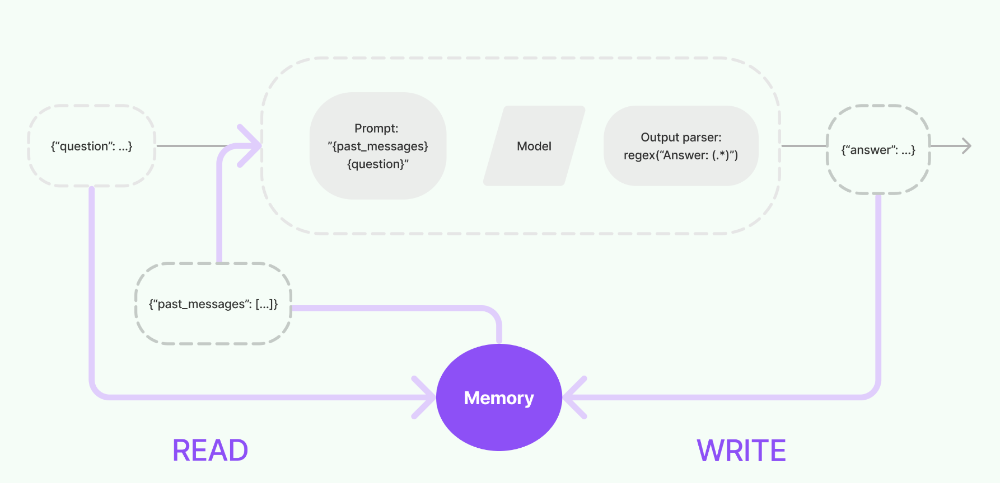

# Memory
LLM Application들은 일반적으로 대화형식의 인터페이스를 다룬다. 대화를 제대로 하기 위해선 이전에 대화 했던 내용을 LLM이 "기억"하고 이후의 대화에서 이전 대화의 정보를 바탕으로 이어나가야 한다.   
Langchain에서는 LLM이 이전 대화 정보를 저장하는 능력을 `Memory`라고 정의했다. Langchain은 `Memory`를 위한 다양한 유틸리티를 제공하고 있다.  

## Memory Flow
Memory는 `READ`, `WRITE` 두 가지 주요 operation으로 동작한다.  
1. User input을 받고 core logic(chain)을 실행하기 전에 chain이 Memory를 `READ`하여 이전 정보를 갖고와서 chain의 input을 바꾼다.
1. core logic 실행 후, 답변을 출력하기 전에 input과 output을 Memory에 `WRITE`하여 현재 대화 내용을 저장한다.

## Store and Query
Memory에 Chat Message들을 저장하고 관리해야 한다(`Store`). In-memory에서 영구적인 DB로 옮길 수 있는 모듈들이 있다.  
Memory에 Chat Message들을 관리하는 것은 비교적 쉬운 일이지만, 이를 가져오는 부분은 좀 더 정교한 작업이 필요할 수 있다(`Query`). 단순히 Memory에서 정보를 그대로 가져올 수도 있고, 현재 대화와 관련된 Entity만 뽑아서 가져올 수도 있다.

이번 장에서는 Memory 시스템을 구축하는 방법을 배워볼 것이다.