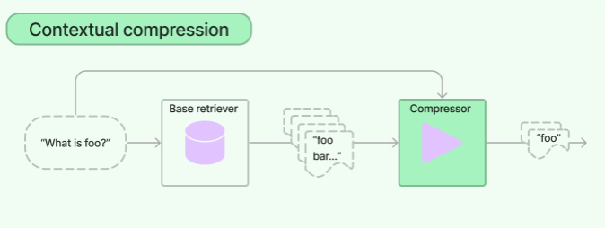

# Retriever
- unstructured query를 받아서 문서를 반환하는 인터페이스이다
- 즉, `query` 문자열을 input으로 받고 `Document` 객체를 반환한다
- backbone으로 vector store가 사용된다
- `Document`를 검색하는 과정에서 vector store의 유사도 검색이나 MMR과 같은 검색 알고리즘을 사용한다
- `get_relevant_documents(query: str)` 함수로 질의를 받고, 질의와 관련된 문서를 검색하고 반환한다. 기본적으로 유사도 검색 알고리즘으로 동작한다
- `db.as_retriever(search_type="mmr")`처럼 `search_type=mmr`로 설정하면 MMR 검색 알고리즘을 사용한다. 검색할 때는 마찬가지로 `get_relevant_documents(query: str)`을 사용한다
- `search_kwargs`에 여러 옵션을 추가할 수 있다
    - `score_threshold`: 유사도 점수 임계값
    - `k`: Top K 명시. 가장 유사한 k개의 문서만 반환

## ContextualCompressionRetriever
- 질의와 관련성이 높은 정보가 많은 양의 무관한 정보와 같이 있을 경우에 LLM 호출 비용이 증가하고 낮은 품질의 답변이 올 수 있는 문제가 있는데 이 문제를 해결하기 위해 고안됐음
- 질의의 맥락에 맞게 문서를 압축하여 관련 정보만 반환되도록 한다. 이 때 압축은 개별 문서의 내용과 전체 문서를 필터링하는 것을 말한다.
- 질의를 `Base Retriever`에 전달하고, 초기 문서들을 다시 `Document Compressor`를 통과시켜 문서 내용을 압축하거나 완전히 삭제한다.

### LLMChainFilter
- 초기 검색된 문서 중에서 내용을 압축하지 않고 선택적으로 반환하는 LLM 체인을 compressor로 사용

### EmbeddingFilter
- 관련없는 문서를 필터링할 때 비싸고 느린 LLM 대신 Embedding 모델을 사용하는 방법

## DocumentCompressorPipeline(압축기 + 문서 변환기 파이프라인)
- `TextSplitter`와 같은 객체로 문서를 더 작은 단위로 분할함으로써 변환하고, 문서 간의 중복 제거와 질의와의 관련성을 기준으로 필터링하는 compressor를 하나의 파이프라인으로 만들어서 사용할 수 있다

## Ensemble Retriever
- 여러 retriever를 입력으로 받아 `get_relevant_documents(query: str)`로 결과를 모은 후, Reciprocal Rank Fusion 알고리즘으로 결과를 reranking한다.
- 서로 다른 알고리즘을 활용하기 때문에 단일 알고리즘 보다 더 나은 성능을 달성할 수 있다
- 일반적으로 서로 상호보완적인 `sparse retriever`(BM25)와 `dense retriever`(embedding simlarity)를 결합하는 `hybrid search` 방식을 사용한다.
    - `sparse retriever`: 키워드 기반으로 문서 찾는데 효과적
    - `dense retriever`: 의미적 유사성을 기반으로 찾는데 효과적
- `langchain_core.runnables.ConfigurableField`로 런타임에서 retriever config를 구성할 수도 있다

## LongContextReorder
- LLM은 긴 context 중간에 있는 정보를 접근해야 할 때 제공된 문서를 무시하는 경향이 있다
- 따라서 검색 후 문서의 순서를 재배열하여 성능 저하를 방지할 수 있다
- `transform_documents(docs)` 함수로 검색된 문서 목록을 재정렬한다. 덜 관련된 문서는 목록 중간에 위치하고, 관련된 문서는 시작과 끝에 위치하도록 정렬한다.

## ParentDocumentRetriever
- 문서 검색 과정에서 문서를 분할할 때 다음 상충되는 두 가지 요소를 고려해야 함
    1. 문서를 작게 분할: 이는 분할된 임베딩이 문맥 의미를 가장 정확하게 반영할 수 있다. 문서가 너무 길면 의미를 잃어버릴 수 있기 때문
    1. 분할된 문서들이 하나의 맥락에 속하는 경우 긴 문서가 필요
- 위의 상충되는 두 가지 요소를 해결하기 위한 것이 `ParentDocumentRetriever`
- 문서를 작은 조각으로 나누고, 이 조각들을 관리한다. 질의를 통해 문서 조각들을 찾은 다음, 조각들이 속해있던 원본 문서를 ID로 식별하여 전체 문서의 맥락도 파악할 수 있다
- 이는 다음 두 가지 특장점이 있다
    1. 문서 간의 계층구조 활용: 문서 간의 계층 구조를 활용하여 검색 효율성 높임
    1. 검생 성능 향상: 관련성 높은 문서를 빠르게 찾아냄과 동시에 적절한 답변을 제공하도록 유도한다

## MultiQueryRetriever
- 임베딩이 데이터의 의미를 제대로 파악하지 못했을 경우, 고차원 공간에서 질의 임베딩과 유사도 기준으로 검색하는 방식이 잘 동작하지 않는다
- `MultiQueryRetriever`는 사용자 질의를 다양한 관점에서 여러 질의를 자동으로 생성하여 프롬프트 튜닝 과정을 자동화한다
- 여러 관점에서 생성한 질의로 관련 문서를 검색하여 합집합을 추출해 잠재적으로 관련된 더 큰 문서 집합을 얻는다.

## MultiVectorRetriever
- 문서를 여러 벡터로 생성함으로써 정보 검색의 정확도와 효율성을 증대시킬 수 있다
- 용도에 맞게 임베딩을 생성하는 다양한 방법이 있다
    1. 작은 청크 생성: 문서를 작은 청크로 나눈 후 청크에 대한 임베딩을 생성. 이는 문서의 세부 정보를 탐색할 때 용이하며 `ParentDocumentRetriever`를 통해 구현할 수 있다
    1. 요약 임베딩: 각 문서의 요약을 생성하고 그 요약에 대해 임베딩을 만든다. 문서의 핵심 내용을 파악하는 데 도움이 된다.
    1. 가설 질문 활용: 문서에 대해 적합한 가설을 만들고 이 질문에 기반한 임베딩 생성. 특정 주제나 내용에 깊이 있는 탐색을 할 때 유용하다.
    1. 수동 추가 방식: 사용자가 고려해야할 특정 질문을 직접 추가. 사용자 검색 과정에서 세밀한 제어가 가능하며 자신의 요구에 맞는 맞춤형 검색이 가능
- `MultiVectorRetriever`를 통해 위처럼 다양한 방법을 유연하게 활용할 수 있다

## SelfQueryRetriever
- 단순히 사용자의 질의를 검색하는 것이 아닌 query-constructing LLM chain을 통해 구조화된 질의를 스스로 만든 다음 vector store에 검색한다.
- 자체적으로 생성한 질의로 질문하면 문서의 메타데이터 필터로 필요한 문서들만 추출하여 찾을 수 있어서 더 정확하고 관련성 높은 결과를 제공할 수 있다

## TimeWeightedVectorStoreRetriever
- 의미론적 유사성 + 시간에 따른 감쇠를 결합하여 검색하는 방식
- 자주 검색되는 문서일 수록 시간이 지나도 높은 점수를 유지하며 그렇지 않은 문서는 점수가 낮게 책정된다.
- 따라서 정보의 유사성과 신선함, 두 가지를 고려하여 검색하는 방식이다
- `decay_rate` 값이 낮을 수록 더 오래 기억하며 0이 되면 절대 잊혀지지 않는다
