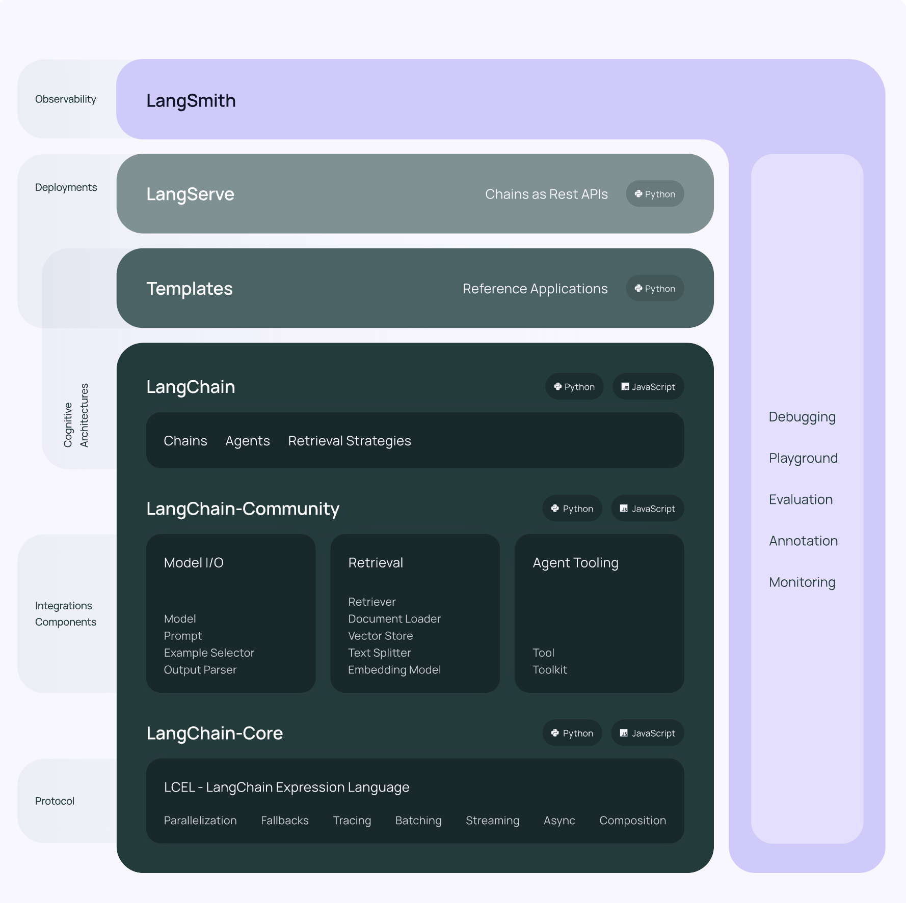

# Langchain

# What is Langchain

 언어 모델을 이용하여 애플리케이션을 만드는데 필요한 도구들(Prompt, Crawler 등)과 API 호출하는 등의 다양한 기능을 제공하는 프레임워크.
 특히 LLM이 외부 데이터를 인식할 수 있게 하고(RAG 시스템), 능동적으로 필요한 도구들을 가져다가 써서 사용자에게 적합한 답변을 반환(Agent)하는 등의 니즈에 의해 등장하게 되었으며, 이러한 도구들을 chain 형식으로 표현해서 langchain이라고 한다. 현재 LLM Application에서 가장 많이 사용하는 도구이다.



그림을 보면서 LangChain의 주요 요소들을 살펴보자

1. LCEL (LangChain Expression Language)
    
    하나의 LLM 어플리케이션을 만들기 위해 여러 langchain 모듈들을 chain 형식으로 구성하게 된다. 이 때 `|` 연산자를 활용해서 아주 쉽게 chain을 만들 수 있는데 이러한 표현 방법을 LCEL이라 한다.
    
    ```python
    llm_chain = prompt | model | output_parser
    llm_chain.invoke("대한민국 수도는 어디야?")
    ```
    
    LCEL에는 몇 가지 특징이 더 있다.
    
    - Streaming: chain의 output에 대해 쉽게 streaming을 할 수 있다
    - Async: 비동기 동작 지원
    - Parallel Excecution: 여러 prompt를 동시에 추론할 수 있다.
    - Retries and Fallbacks: chain에 대해 retry와 fallback을 추가할 수 있어 신뢰성을 높일 수 있다.
    - Access Intermediate results: 복잡한 chain에 대해서 중간 결과를 스트리밍 할 수 있다.
    - Input & Output schema: chain의 input, output의 스키마를 Pydantic과 Json 형식으로 확인할 수 있으며, 서빙할 때 input & output에 대한 검증을 할 수 있다.
2. Model I/O
    - 공통 인터페이스로 다양한 LLM Model과 통신
    - 다양하고 복잡한 Prompt를 비교적 쉽게 구성 가능
    - 모델 출력에서 다양한 정보 추출 가능
3. Retrieval
    - 외부 데이터를 잘 활용하기 위한 모듈들이 포함되어 있음
    - 다양한 형식의 문서를 불러올 수 있는 Document Loader, 외부 데이터들을 저장할 수 있는 Vector Store 등을 제공
4. Chain
    - LCEL로 langchain의 다양한 모듈들을 chain으로 묶어서 하나의 llm 호출 시퀀스를 만듦
5. Agent
    - 단순히 prompt와 llm 뿐만 아니라, 다양한 tool을 chain에 포함시켜서 보다 복잡한 작업을 할 수 있게 함.

## Links

[Introduction | 🦜️🔗 LangChain](https://python.langchain.com/v0.2/docs/introduction/)

[(1) Langchain이란 무엇인가? 개념과 모듈 구성을 알아보자](https://yongeekd01.tistory.com/92)

# What is Prompt Engineering

 우선 Prompt란 LLM 모델에게 전달하는 질문, 지시 등과 같은 입력을 말한다. 모델에게 어떻게 Prompt를 구성o해서 넣어주냐에 따라 같은 모델이라도 답변의 퀄리티 차이가 많이 날 수 있으며, 어떤 상황에서 어떻게 Prompt를 구성할 지 연구하는 것이 Prompt Engineering이라고 한다.

Prompt Engineering에도 여러 기법이 존재하는데 대표적인 몇가지만 살펴보자

1. Zero-Shot
    
    어떠한 예시도 없이 바로 질문하거나 지시하는 기법.
    
    ```bash
    # 입력
    텍스트를 중립, 부정 또는 긍정으로 분류합니다.
    
    텍스트: 휴가는 괜찮을 것 같아요.
    감정:
    
    # 답변
    중립
    ```
    
2. X-Shot (One Shot or Few Shot)
    
    1개 이상의 예시를 포함하여 Prompt를 구성하는 기법. Few Shot Prompting만 해도 성능이 꽤 잘 나오는 걸 볼 수 있다.
    
    ```bash
    # 입력
    "whatpu"는 탄자니아에 서식하는 작은 털복숭이 동물입니다. whatpu를 사용하는 문장의 예
    라는 단어를 사용하는 문장의 예입니다:
    우리는 아프리카를 여행하고 있었는데 아주 귀여운 whatpu를 보았습니다.
    "farduddle"을 한다는 것은 정말 빠르게 위아래로 점프한다는 뜻입니다. farduddle을 사용하는 문장의 예
    를 사용하는 문장의 예입니다:
    
    # 답변
    게임에서 이겼을 때 우리 모두는 farduddle를 시작했습니다.
    ```
    
    
    
3. Chain of Thought (CoT)
    
    보다 복잡한 추론을 요하는 경우에 COT 기법의 Prompt를 구성하면 더 정확한 답변을 받을 수 있다. 아래 예시처럼 계산하는 과정을 알려주면 모델이 추론할 때 잘 답변할 수 있다. 즉, 핵심은 복잡한 과정이 필요한 경우에 Prompt에 복잡한 과정을 같이 넣어주면 훨씬 더 잘 맞출 수 있다는 것이다. 다만 이는 LLM 모델에만 해당한다.
    
    
    

 모델마다, 도메인마다 효과적인 Prompt가 다 다르기 때문에 이것이 가장 좋다! 라는 기법은 따로 없다. 그리고 Prompt Engieering을 열심히 해도 결과가 잘 안나올 수 있는데, 어쩌면 모델의 한계일 수 있으며, 추후에 더 좋은 모델이 나왔을 때 자연스럽게 해결될 수도 있다. 때문에 가장 열심히 해야되는 부분이면서도, 너무 빠져들 필요가 없을 것 같다.

이외에도 다양한 Pormpt가 있는데 나머지는 아래 링크를 참고.

## Links

[프롬프트 엔지니어링 가이드 – Nextra](https://www.promptingguide.ai/kr)